# PulsePrice: Real-Time Dynamic Surge Pricing Engine

**PulsePrice** is a high-performance, distributed Big Data application that implements dynamic, demand-based surge pricing for e-commerce, using a hybrid Windows/Linux architecture.

---

## 🚀 1. Overview
In a traditional e-commerce environment, pricing is static and fails to capture revenue during demand spikes or manage inventory effectively during slowdowns. **PulsePrice** solves this by analyzing live user click-streams and using a **Random Forest ML Model** to adjust prices every 10 seconds, responding to market "Pulses" in real-time.

---

## ⚡ 2. The Problem Statement
- **Static Inefficiency**: Fixed prices lose potential profit during high-demand events.
- **Inventory Bloat**: Lack of automated drops leads to unsold stock and capital lock-up.
- **Competitor Lag**: Manual price adjustments cannot react quickly to competitor changes.
- **Data Latency**: Traditional databases cannot handle millions of click events for real-time analysis.

---

## 🏗️ 3. Unified Big Data Architecture

Our system follows a professional, enterprise-grade data pipeline from acquisition to real-time analytics.

```mermaid
graph LR
    subgraph Sources ["1. DATA ACQUISITION"]
        direction TB
        S1["<b>Live Clickstream</b><br/>User Views/Carts"]
        S2["<b>Product Meta</b><br/>JSON Seed Data"]
    end

    subgraph Ingest ["2. ORCHESTRATION"]
        direction TB
        K1["<b>Apache Kafka</b><br/>Message Broker"]
        Z1["<b>Zookeeper</b><br/>Cluster Manager"]
    end

    subgraph Core ["3. THE BIG DATA CORE"]
        direction TB
        subgraph HDFS_Box ["Hadoop Distributed File System"]
            H1["<b>HDFS</b><br/>Persistent Storage"]
        end
        subgraph Spark_Box ["Spark Streaming Engine"]
            SP["<b>Apache Spark</b><br/>In-Memory Processing"]
        end
    end

    subgraph Analytics ["4. ANALYTICS & AI"]
        direction TB
        ML["<b>Random Forest</b><br/>ML Regressor"]
        PR["<b>Surge Logic</b><br/>Pricing Decisions"]
    end

    subgraph Delivery ["5. REAL-TIME DELIVERY"]
        direction TB
        DB["<b>PostgreSQL</b><br/>Price History"]
        WS["<b>WebSockets</b><br/>Live Push"]
    end

    subgraph UI ["6. REPORTING"]
        direction TB
        D1["<b>React Dashboard</b><br/>Final Visualization"]
    end

    %% Connections
    Sources ==> Ingest
    Ingest ==> Core
    Core <==> Analytics
    Core ==> Delivery
    Delivery ==> UI

    %% Styling
    style Core fill:#e3f2fd,stroke:#1565c0,stroke-width:2px
    style HDFS_Box fill:#bbdefb,stroke:#0d47a1
    style Spark_Box fill:#bbdefb,stroke:#0d47a1
    style Sources fill:#f5f5f5,stroke:#333
    style UI fill:#fff3e0,stroke:#e65100,stroke-width:2px
    style ML fill:#e1f5fe,stroke:#01579b
```

### 🛣️ The "Life of a Click" — Professional Breakdown

1.  **Ingestion (Velocity)**: Raw user events are generated on the Windows node and buffered in **Kafka** on the Ubuntu node. This decouples the simulation from the processing.
2.  **Streaming (Intelligence)**: **Apache Spark** pulls data every 10s. It doesn't just calculate averages; it consults the **Random Forest** committee to decide the next price based on 200,000 historical training points.
3.  **Persistence (Integrity)**: Final pricing decisions are saved in **PostgreSQL**. **HDFS** acts as the high-availability layer, storing "Checkpoints" so the system can recover instantly if a laptop disconnects.
4.  **Consumption (Visibility)**: The **React Dashboard** uses WebSockets to show the user "Surge" or "Drop" alerts the millisecond they are calculated.

---

### 🧠 The Distributed Logic "Deep-Dive"

> [!IMPORTANT]
> **Why this Architecture Wins:**  
> This isn't just a web app; it is a **Distributed Streaming Cluster**. By separating **Compute (Mohan)** from **Infrastructure (Kartheek)**, we achieve **Horizontal Scalability**. In a real-world scenario, you could add 10 more "Mohan" laptops to handle 10x more traffic without ever touching the "Kartheek" master server.

---

## 🛠️ 4. Technical Component Breakdown

### 📮 The Messaging Layer (Kafka & Zookeeper)
*   **Zookeeper**: The "Traffic Controller" that manages Kafka's state and synchronization.
*   **Kafka**: A distributed log that captures raw user behavior. We use a single-broker configuration on the Master node for simplicity but high throughput.

### ⚡ The Processing Layer (Spark & Random Forest)
*   **Spark Streaming**: The backbone of our real-time engine. It processes data in **DStreams** (Discretized Streams), converting raw JSON events into numerical demand scores.
*   **ML Engine**: A **Random Forest Regressor** trained on 200,000 samples. It evaluates 11 different features per product to predict the "Optimal Market Price" every 10 seconds.

### 🐘 The Storage Layer (HDFS & PostgreSQL)
*   **HDFS**: Our "Big Data Lake." It provides a persistent, distributed file system where Spark saves its **Metastore** and recovery checkpoints.
*   **PostgreSQL**: Our "Hot Storage." It stores the final analytical results that the React UI needs to display.

---

## 🤖 5. Machine Learning Layer
We use a **Random Forest Regressor** trained on 200,000 synthetic shopping scenarios. Unlike simple linear rules, the model understands the **non-linear relationships** between views, cart-adds, purchases, and stock levels.

- **Inputs**: View count, cart rate, conversion rate, stock level, day of week, hour of day.
- **Output**: A price multiplier (e.g., 0.92x for drops, 1.15x for surges).
- **Optimization**: The model is "Speed-Optimized" for real-time inference within the Spark micro-batch.

---

## 📊 6. Key Features
- **Live Market Mood**: A dynamic "Fear vs Greed" index based on the percentage of current surges.
- **Viral Product Detection**: Automatically detects and surfaces "Trending" items with 10x traffic boosts.
- **Adaptive Micro-Batches**: Prices update every 10 seconds for a highly responsive dashboard.
- **Self-Healing Backend**: Integrated scripts for automated IP re-configuration between nodes.

---

## 🏁 7. Conclusion
PulsePrice proves that Big Data technologies like **Spark** and **Kafka** are necessary for modern e-commerce. By combining real-time streaming with Machine Learning forecasting, we turn static data into actionable revenue growth.

---

**University Project - BDA Practical Demo**  
*Developers: Mohan & Kartheek*
