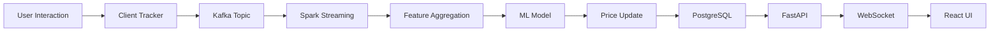
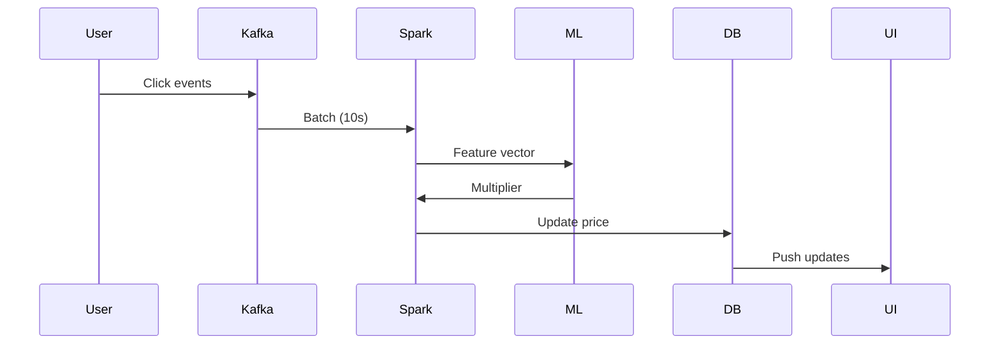
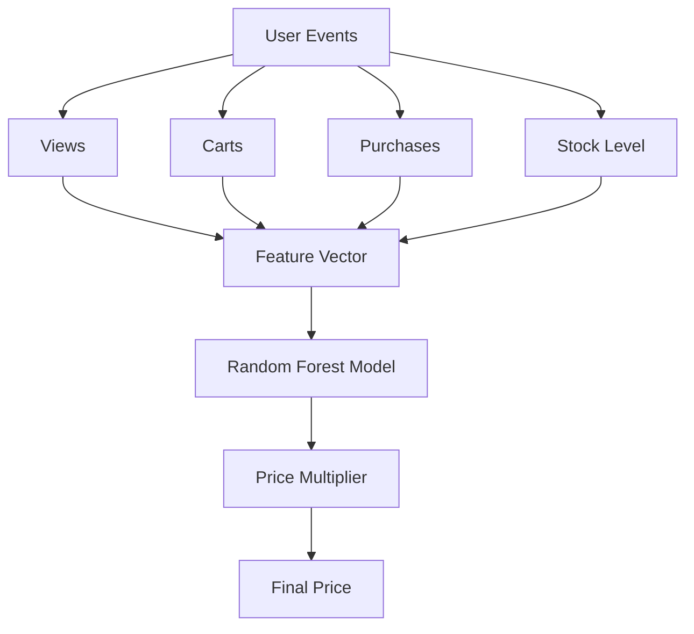
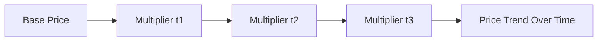

# ⚡ PulsePrice: Real-Time Dynamic Surge Pricing Engine

**PulsePrice** is a high-performance, real-time dynamic pricing system that leverages **Big Data streaming** and **Machine Learning** to continuously adjust product prices based on live user demand signals — all running on a single Ubuntu machine.

---

## 🚀 1. Overview

Traditional e-commerce platforms rely on static pricing, which fails to capture revenue during demand spikes and leads to inefficiencies during low demand.

**PulsePrice transforms pricing into a live system.**

By processing real-time clickstream data (views, carts, purchases), it dynamically adjusts prices every **10 seconds** using a **Random Forest ML model**, enabling intelligent, demand-aware pricing decisions.

---

## ⚡ 2. Problem Statement

Modern pricing systems struggle with:

* **Static Inefficiency** → Missed revenue during high-demand periods
* **Inventory Bloat** → Unsold stock due to lack of adaptive pricing
* **Slow Reaction Time** → Manual updates can’t keep up with market changes
* **Data Bottlenecks** → Traditional systems fail to process high-velocity event streams

---

## 🏗️ 3. Unified Big Data Architecture

```mermaid
graph LR
    subgraph Sources ["1. DATA ACQUISITION"]
        S1["Clickstream Events"]
        S2["Product Metadata"]
    end

    subgraph Ingest ["2. ORCHESTRATION"]
        K1["Kafka"]
        Z1["Zookeeper"]
    end

    subgraph Core ["3. BIG DATA CORE"]
        SP["Spark Streaming"]
        H1["HDFS"]
    end

    subgraph Analytics ["4. ML & PRICING"]
        ML["Random Forest"]
        PR["Pricing Logic"]
    end

    subgraph Delivery ["5. DELIVERY"]
        DB["PostgreSQL"]
        API["FastAPI"]
        WS["WebSockets"]
    end

    subgraph UI ["6. FRONTEND"]
        FE["React Dashboard"]
    end

    Sources --> Ingest --> Core --> Analytics --> Delivery --> UI
```

---

## 🔄 4. System Data Flow

---

## ⚡ 5. Micro-Batch Processing Cycle

---

## 🛣️ 6. The Life of a Click

1. **Ingestion**
   User actions are captured as clickstream events and streamed to **Kafka**.

2. **Processing**
   **Spark Streaming** aggregates events into demand signals every 10 seconds.

3. **Prediction**
   The **Random Forest model** evaluates features and outputs a price multiplier.

4. **Storage**
   Updated prices are written to **PostgreSQL**, while **HDFS** stores checkpoints.

5. **Delivery**
   The **React dashboard** receives updates via WebSockets in real time.

---

## 🧠 7. ML Pricing Logic

---

## 📈 8. Price Evolution (Visualization)

---

## 🛠️ 9. Technical Stack

### 📮 Messaging Layer

* Kafka (event streaming)
* Zookeeper (coordination)

### ⚡ Processing Layer

* Spark Streaming (real-time processing)
* Random Forest (ML predictions)

### 🐘 Storage Layer

* PostgreSQL (live pricing + history)
* HDFS (checkpointing + recovery)

---

## 🤖 10. Machine Learning Model

* **Algorithm**: Random Forest Regressor
* **Inputs**: views, carts, purchases, stock, time features
* **Output**: price multiplier

### Key Advantage:

Captures **non-linear relationships** between demand and pricing.

---

## 📊 11. Key Features

* 🔴 Real-time demand tracking
* 📈 Dynamic price updates (every 10s)
* 🚀 Trending product detection
* 📡 Live dashboard via WebSockets
* 💻 Runs fully on a single machine

---

## 🏁 12. Conclusion

PulsePrice demonstrates how **streaming systems + ML** can transform pricing into a **real-time intelligent process**.

It connects:

> user behavior → data pipeline → ML decisions → live price updates

---

## 💡 Final Note

This project is designed as a **production-style architecture prototype**, showing how scalable pricing systems can be built even in constrained environments.

---
